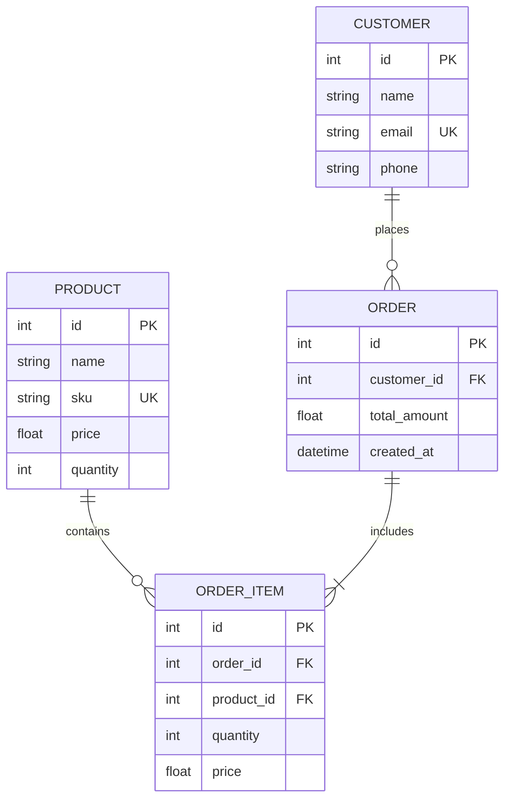

# Production-Ready Inventory & Order Management System

A containerized, full-stack enterprise inventory control and order tracking system. Built with **FastAPI** (Python), **React** (JavaScript + Vite), and **PostgreSQL**, orchestrated using **Docker Compose**.

---

## 🚀 Quick Start (Docker Compose)

The entire application stack is containerized and configured to start with a single command.

### Prerequisites
* [Docker Desktop](https://www.docker.com/products/docker-desktop/) installed and running.

### Spin up the services
From the root directory of the project, run:
```bash
docker compose up --build
```

This starts three services:
1. **PostgreSQL Database (`db`)** on port `5432` with a persistent Docker volume.
2. **FastAPI Backend (`backend`)** on port `8000`.
3. **React Frontend (`frontend`)** on port `3000`.

### Database Auto-Seeding
On its initial startup, if the database is completely empty, the backend will **automatically seed mock data** (5 Products, 3 Customers, and 1 Order). This makes testing and evaluating the frontend immediate!

Access endpoints:
* **Frontend Web App**: [http://localhost:3000](http://localhost:3000)
* **Backend API Root**: [http://localhost:8000](http://localhost:8000)
* **Interactive API Documentation (Swagger)**: [http://localhost:8000/docs](http://localhost:8000/docs)

---

## 🛠️ Architecture & Technology Stack

* **Backend**: FastAPI (Python 3.11). High performance, automatic OpenAPI schema generation, and asynchronous database capability.
* **ORM**: SQLAlchemy. Leverages relational mappings with transactions.
* **Validation**: Pydantic v2. Strong typing and constraints (e.g. non-negative pricing/stock).
* **Frontend**: React (Vite setup). High-speed hot module replacement, using standard state hooks and native Fetch API.
* **Styling**: Vanilla CSS. Crafted using custom HSL color systems, glassmorphism, responsive grid sheets, micro-interaction buttons, and a dark theme.
* **Database**: PostgreSQL (v15 Alpine). Managed with named volumes to prevent data loss.

---

## 📊 Database Schema



---

## 💼 Core Business Rules Implemented

The backend is the single source of truth and enforces these operational rules strictly:
1. **Unique SKUs**: Product creation or modifications fail (HTTP 400) if the SKU matches an existing product.
2. **Unique Emails**: Customers are validated, rejecting duplicate emails.
3. **Inventory Stock Checks**: Orders cannot exceed stock. Attempting to place an order with insufficient inventory returns an error, and the database transaction rollbacks.
4. **Atomic Adjustments**: Stock reduction is handled within an ACID transaction.
5. **Autocalculated Order Totals**: The backend aggregates order totals based on current catalog pricing.
6. **Restocking on Cancellation**: Cancelling/Deleting an order automatically returns the items to the inventory stock.

---

## 🔗 API Endpoints Documentation

### Products
* `POST /products` - Create product (Validates unique SKU, quantity &ge; 0, price &ge; 0).
* `GET /products` - Retrieve all products.
* `GET /products/{id}` - Retrieve details of a specific product.
* `PUT /products/{id}` - Update details (names, prices, quantities).
* `DELETE /products/{id}` - Delete product.

### Customers
* `POST /customers` - Create customer (Validates unique email format).
* `GET /customers` - Retrieve all customer records.
* `GET /customers/{id}` - Retrieve customer profiles.
* `DELETE /customers/{id}` - Delete customer profile.

### Orders
* `POST /orders` - Place order.
  * *Request Body:* `{ "customer_id": 1, "items": [ { "product_id": 2, "quantity": 3 } ] }`
* `GET /orders` - Retrieve list of orders.
* `GET /orders/{id}` - Retrieve detailed breakdown (lists products, quantities, prices at purchase, and customer details).
* `DELETE /orders/{id}` - Cancel/delete an order (automatically restocks catalog).

---

## ☁️ Cloud Deployment Guide

To deploy this project to public hosting providers:

### 1. Database & Backend Deployment (e.g. Render / Railway)

#### Database Setup
1. Create a **PostgreSQL** instance on [Render](https://render.com) or Supabase.
2. Copy the **External Database URL**.

#### FastAPI Backend Setup
1. Deploy a new Web Service from your Git repository on Render.
2. Select runtime: **Docker**. Dockerfile path is `backend/Dockerfile` (or set the root directory context to `backend`).
3. Add these **Environment Variables**:
   * `DATABASE_URL`: Set to your PostgreSQL connection string.
4. Click deploy. Render builds the Docker image and gives you a backend API URL (e.g. `https://my-backend.onrender.com`).

### 2. Frontend Deployment (e.g. Vercel / Netlify)

1. Deploy a new project on **Vercel** or **Netlify** linked to the Git repository.
2. Set root directory to `frontend`.
3. Set the **Build Command** to: `npm run build`
4. Set the **Output Directory** to: `dist`
5. Configure the **Build Environment Variables**:
   * `VITE_API_URL`: Set to your live backend API URL (e.g. `https://my-backend.onrender.com`).
6. Click deploy. Vercel compiles the React code and outputs a public URL (e.g., `https://my-inventory-hub.vercel.app`).

---

## 💻 Manual Local Development (No Docker)

If you wish to run the applications directly on your local machine:

### Backend
1. Navigate to `backend/`
2. Create virtual environment:
   ```bash
   python -m venv venv
   source venv/Scripts/activate # On Windows: venv\Scripts\activate
   ```
3. Install dependencies:
   ```bash
   pip install -r requirements.txt
   ```
4. Configure `.env` file (you can configure it to point to a local PostgreSQL instance or SQLite if needed).
5. Run the dev server:
   ```bash
   uvicorn app.main:app --reload --port 8000
   ```

### Frontend
1. Navigate to `frontend/`
2. Install dependencies:
   ```bash
   npm install
   ```
3. Copy environment settings:
   ```bash
   # create a .env.local file with
   VITE_API_URL=http://localhost:8000
   ```
4. Start dev server:
   ```bash
   npm run dev
   ```
